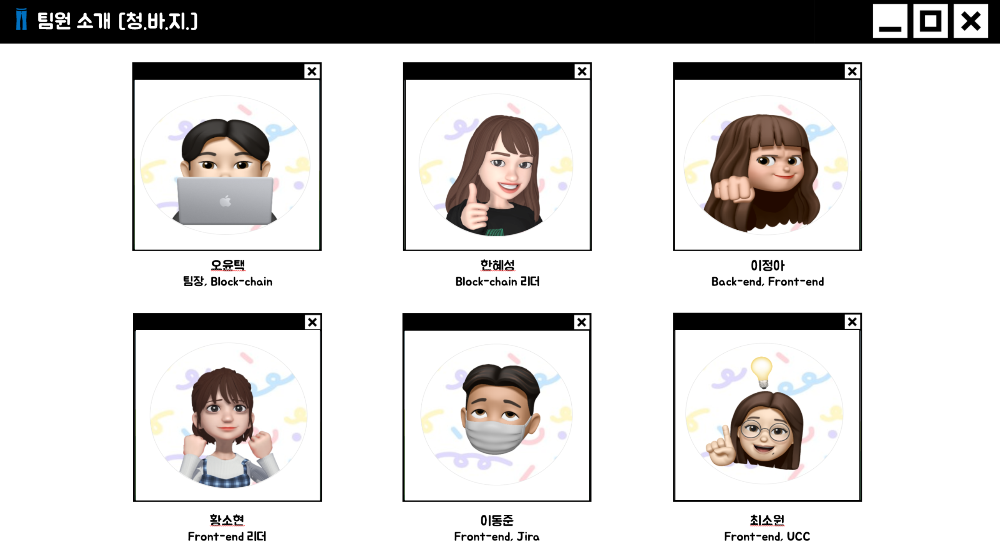
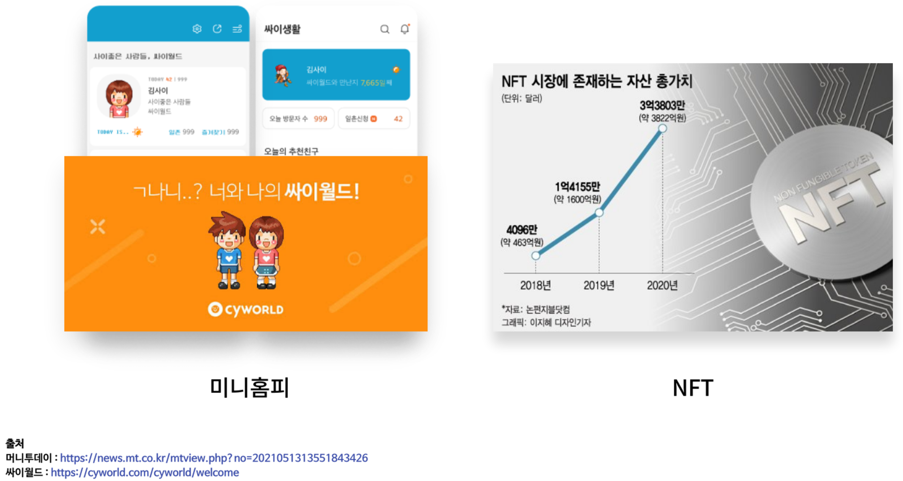
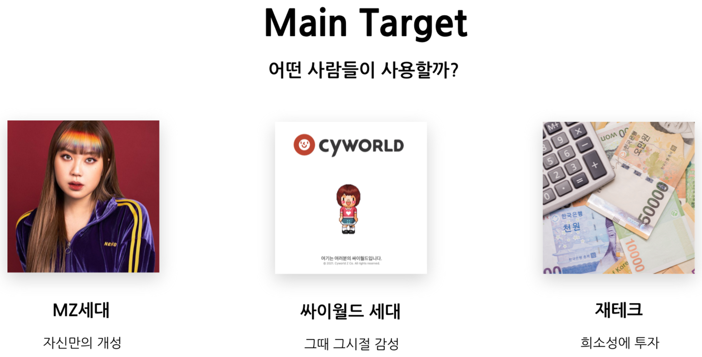
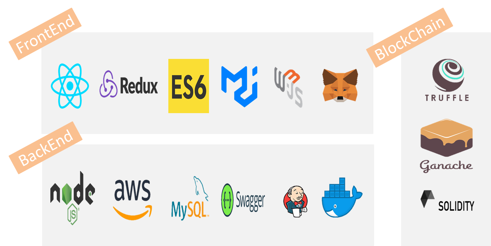
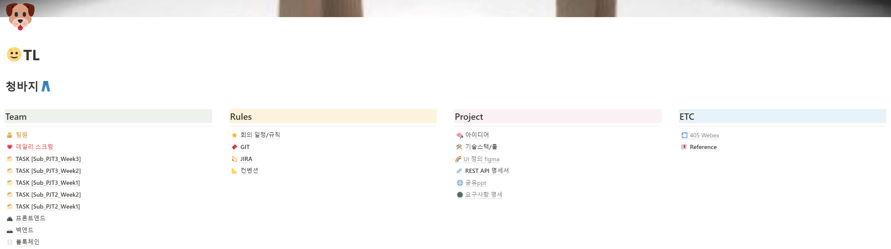
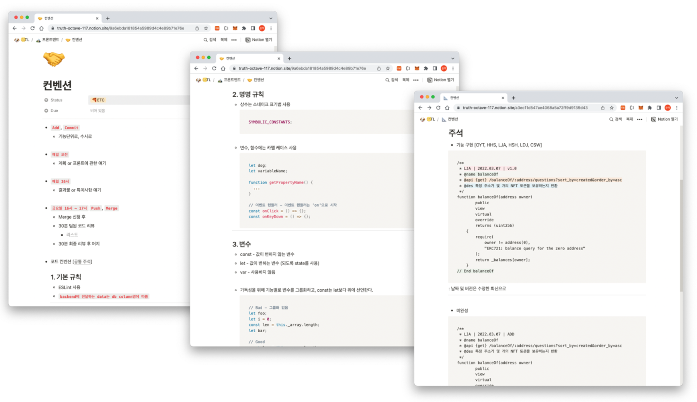
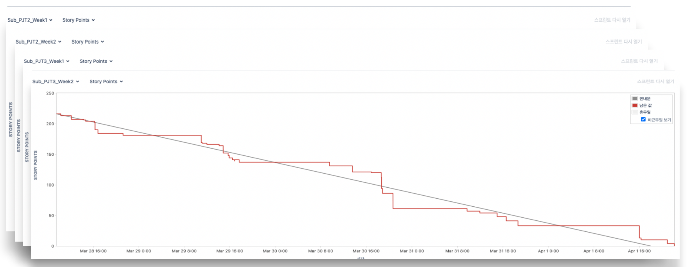
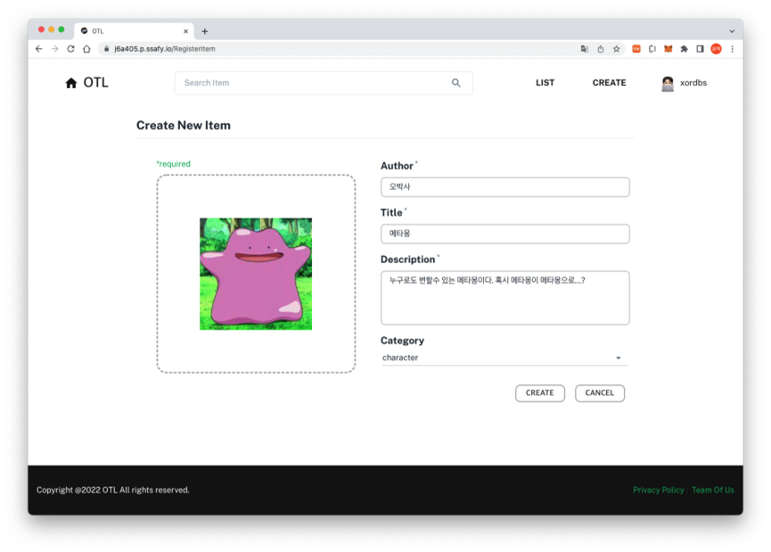
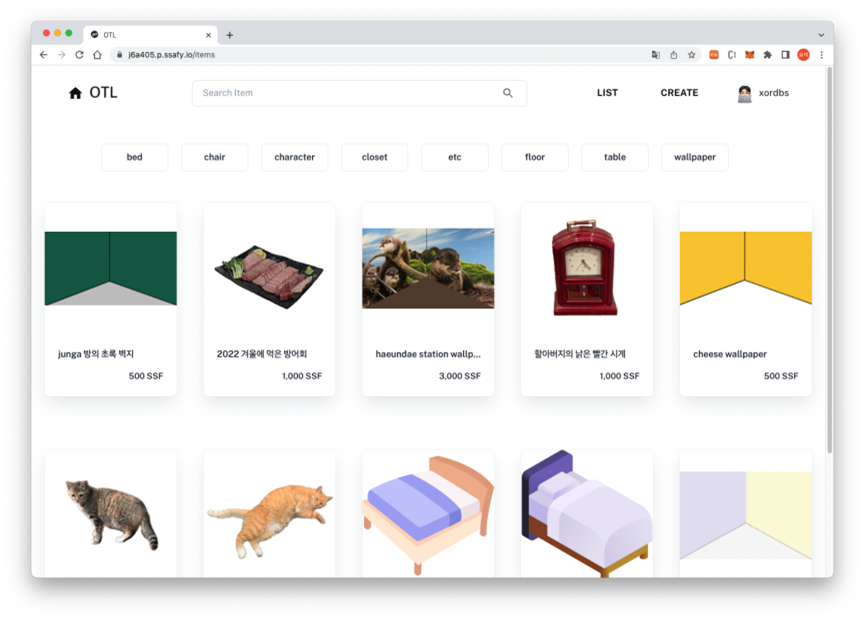
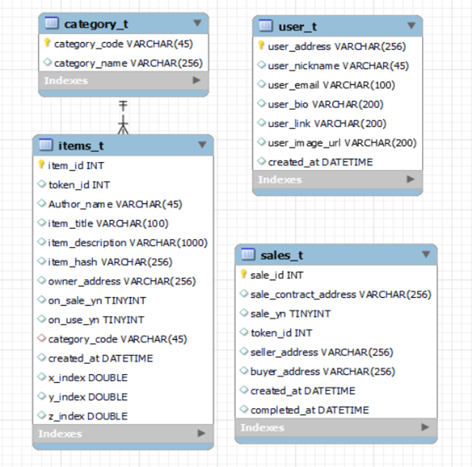

   

  

   

   


# ❓ OTL [One can Take Limited] 

[[_TOC_]]


## 1. OTL 소개

- 개발 기간 : 2022년 2월 28일 [월] ~ 2022년 4월 7일 [목]

- 주제 : 미니홈피 기능을 결합한 **블록체인 기반 탈중앙형 NFT 거래 플랫폼** 서비스
- 팀명 : 👖 청바지! (**청**춘은 **바**로 **지**금)



---


## 2. 개요

❓ 내 손안의 **농장, 쑥쑥!**

> 😷 코로나 시국이 장기화 됨에 따라 도시 속에서 **친환경적인 취미**에 관심을 가지는 사람들이 늘어나고 있습니다.
>
> 그 중에서도 **도시농업**과 **주말농장**에 대한 수요가 늘어나고 있으며 특히, 1인가구에서는 옥상에 작은 **텃밭**을 가꾸어 자급자족하기도하며 가족 단위로는 주말농장에 텃밭을 신청해서 **농작물**을 키우기도 합니다.
>
> 위와 같은 취미를 가지는 고객들이 좀 더 나은 환경에서 농작물을 키울 수 있도록 하기 위해 📝 **농작물의 기록과 관리**를 수월하게 해주고, **커뮤니티**를 통해 같은 관심사를 가진 사람들끼리 💬 **소통**을 할 수 있는 장을 마련해주고자 했습니다.


### OTL 기획 배경 / 타겟





---


## 3. 기술 스택



---


## 4. 형상 관리

### [`Notion`](https://truth-octave-117.notion.site/TL-8fc2391a556b447d9ca4a70cf1fd194a)






### [`Jira`](https://truth-octave-117.notion.site/JIRA-07fb44a9c7684e3093b750a0a4133fed) / [`Task`](https://truth-octave-117.notion.site/21b074b0bf7d438f979f64389a248401?v=72ac930430d0454383d61eb962116cf5)



---


## 5. 주기능 소개

### 주기능 1-1. Minting [NFT 생성]




### 주기능 1-2. Buy [NFT 구매]


### 주기능 1-3. List [판매중인 NFT 목록]




### 주기능 2. My Room [보유 NFT 목록 조회 / 방 꾸미기]


---


## 6. ERD [DB Modeling]



---


## 7. 실행 방법

### Front-End (Back-end 동일)

1. 디렉토리 이동

```tex
cd frontend/ (cd backend/)
```


2. 필요한 패키지 설치 [`node-modules` 설치]

```tex
npm install
```


3. 실행

```tex
npm start
```

---


## 8. 트리 구조

- [`Front-End`]()
- [`Back-End`]()

---


## 9. Contributors

- [`O YunTaek`](https://github.com/xordbs)
- [`Han Hyesung`](https://github.com/Hyesung-Han)
- [`Lee Junga`](https://github.com/wjddk7507)
- [`Hwang Sohyeon`](https://github.com/thgus)

- [`Lee Dongjune`](https://github.com/Dorororodong)
- [`Choi Sowon`](https://github.com/sowonlevelup)
